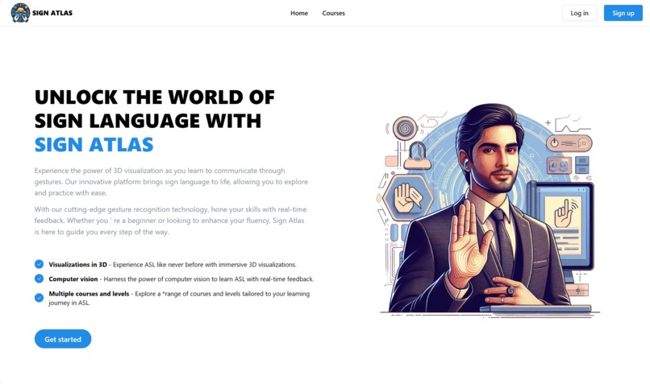
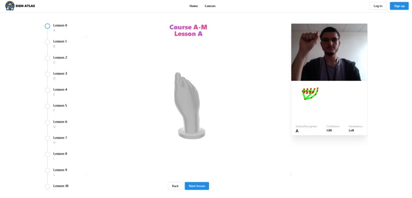

# Sign Atlas

[](https://opensource.org/licenses/MIT)
[](https://nextjs.org/)
[](https://www.typescriptlang.org/)
[](https://developers.google.com/mediapipe)
[](https://threejs.org/)

An interactive web platform for learning American Sign Language (ASL) using real-time gesture recognition, 3D hand models, and gamified quizzes.

[DEVPOST - MariHacks 7.0 First place - advanced](https://devpost.com/software/sign-atlas)

---

### **Visual Demo**




### **Table of Contents**

- [Sign Atlas](#sign-atlas)
    - [**Visual Demo**](#visual-demo)
    - [**Table of Contents**](#table-of-contents)
    - [**About The Project**](#about-the-project)
    - [**Key Features**](#key-features)
    - [**Tech Stack**](#tech-stack)
    - [**Architecture**](#architecture)
    - [**Getting Started**](#getting-started)
      - [**Prerequisites**](#prerequisites)
      - [**Installation**](#installation)
    - [**Usage**](#usage)
    - [**Technical Challenges \& Lessons Learned**](#technical-challenges--lessons-learned)
    - [**Future Improvements**](#future-improvements)
    - [**License**](#license)

---

### **About The Project**

Learning American Sign Language can be a challenging endeavor, often hampered by a lack of immediate, interactive feedback. Traditional methods like static images or videos can make it difficult to understand the complex, three-dimensional nature of hand signs.

Sign Atlas was built to solve this problem. It's an immersive, browser-based learning platform that makes acquiring ASL skills more accessible and engaging. By leveraging modern web technologies, it provides learners with real-time gesture recognition from their webcam, interactive 3D models to inspect signs from any angle, and a structured, gamified curriculum to test their knowledge. This project aims to bridge the gap between learning and practicing, creating a seamless and effective educational experience.

### **Key Features**

*   **🤘 Real-Time Gesture Recognition:** Utilizes a custom-trained machine learning model via MediaPipe to translate ASL signs from a live webcam feed directly in the browser.
*   **🎓 Structured Learning Modules:** Offers courses that break down the ASL alphabet into manageable lessons (e.g., A-M, N-Z).
*   **🧠 Gamified Quizzes:** Interactive tests that challenge users to sign the correct letter, providing instant visual feedback on their accuracy.
*   **🧊 Interactive 3D Visualizations:** Renders a 3D model for each ASL letter, allowing users to rotate, pan, and zoom to understand the precise hand shape from any perspective.
*   **🌐 Fully Client-Side:** The entire application, including the ML model inference, runs in the web browser, ensuring privacy and a fast, responsive user experience with no server-side dependency for the core features.

### **Tech Stack**

The project is built with a modern, full-stack JavaScript and Python toolchain:

| Category          | Technologies                                                                                                 |
| ----------------- | ------------------------------------------------------------------------------------------------------------ |
| **Frontend**      | Next.js, React, TypeScript, Mantine UI                                                                       |
| **3D Graphics**   | React Three Fiber, Three.js                                                                                  |
| **ML Inference**  | MediaPipe Tasks for Vision (GestureRecognizer)                                                               |
| **ML Model Training** | Python, TensorFlow, MediaPipe Model Maker, OpenCV                                                               |
| **Deployment**    | Vercel                                                                                                       |

### **Architecture**

The application has two primary components: the offline model training pipeline and the online Next.js application.

1.  **Model Training (Offline):** A set of Python scripts (`collect_imgs.py`, `create_dataset.py`) are used to gather image data and train a custom gesture recognition model using the MediaPipe Model Maker library. This process outputs a lightweight `.task` file optimized for on-device inference.
2.  **Next.js Application (Online):** The frontend is a server-rendered React application. The trained `.task` model is loaded directly into the browser. MediaPipe's `GestureRecognizer` then uses this model to perform real-time inference on the user's webcam stream. This client-side approach minimizes latency and removes the need for a dedicated ML backend server.

### **Getting Started**

To get a local copy up and running, follow these simple steps.

#### **Prerequisites**

Ensure you have Node.js and npm (or yarn) installed on your machine.

*   npm
    ```sh
    npm install npm@latest -g
    ```

#### **Installation**

1.  Clone the repository:
    ```sh
    git clone https://github.com/ParsaJafarian/sign-atlas.git
    ```
2.  Navigate to the project directory:
    ```sh
    cd sign-atlas
    ```
3.  Install NPM packages:
    ```sh
    npm install
    ```
4.  Run the development server:
    ```sh
    npm run dev
    ```
5.  Open [http://localhost:3000](http://localhost:3000) in your browser to see the application.

*Note: The Python scripts in the `ASLTranslatorModel/` directory are for retraining the model and are not required to run the web application.*

### **Usage**

Once the application is running, you can:

*   Navigate to the **Courses** page to start a learning module.
*   Follow the lessons, using the 3D hand models to guide you.
*   Use the integrated ASL Translator camera view to practice making the signs.
*   Take a **Practice** quiz to test your knowledge with real-time feedback.

### **Technical Challenges & Lessons Learned**

This project presented several interesting technical challenges that were crucial to its success.

1.  **Challenge: Achieving Real-Time, In-Browser Gesture Recognition**
    *   **Problem:** Performing machine learning inference on a live video stream can be computationally expensive. Doing this in the browser without significant latency or freezing the UI is a major challenge.
    *   **Solution:** I chose to use MediaPipe's `GestureRecognizer` task with its efficient WebAssembly (WASM) backend. The custom-trained TensorFlow Lite model (`.task` file) is loaded on the client-side, eliminating server round-trips for predictions. To stabilize the output and prevent flickering, the prediction logic incorporates a confidence threshold and a debouncing mechanism that confirms a gesture only after it's been detected consistently across several frames.
    *   **What I Learned:** This taught me the fundamentals of client-side ML, the trade-offs between server-side and on-device inference, and how to optimize for performance in real-time browser applications.

2.  **Challenge: Integrating Interactive 3D Models into a Web UI**
    *   **Problem:** Static 2D images of ASL signs can be ambiguous. To provide a clear learning aid, users needed the ability to inspect the hand shapes from any angle.
    *   **Solution:** I integrated **React Three Fiber** to render `.gltf` 3D models within the React component tree. I created a reusable `<ASL3DHand />` component that dynamically loads the correct model based on the current lesson. Camera controls were added to allow users to intuitively rotate, pan, and zoom the model.
    *   **What I Learned:** This was an excellent opportunity to dive into 3D rendering in a declarative React environment. I learned how to manage 3D assets, set up lighting and cameras, and bridge the gap between a standard web UI and an interactive 3D scene to create a more engaging and effective user experience.

### **Future Improvements**

While the current version is fully functional, here are some features I'd like to add to enhance the platform:

*   **User Authentication & Progress Tracking:** Implement a full backend with a database to allow users to sign up, log in, and save their progress across courses and quizzes.
*   **Expanded Vocabulary:** Train the ML model to recognize full words and common phrases, moving beyond the alphabet.
*   **Dockerize Training Pipeline:** Containerize the Python model training environment with Docker to ensure perfect reproducibility for anyone wanting to retrain or fine-tune the model.
*   **Gamification Features:** Introduce a points system, achievements, and a leaderboard to further motivate users and encourage consistent practice.

### **License**

Distributed under the MIT License. See `LICENSE` for more information.